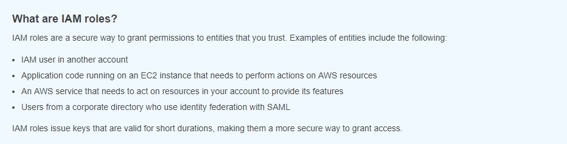
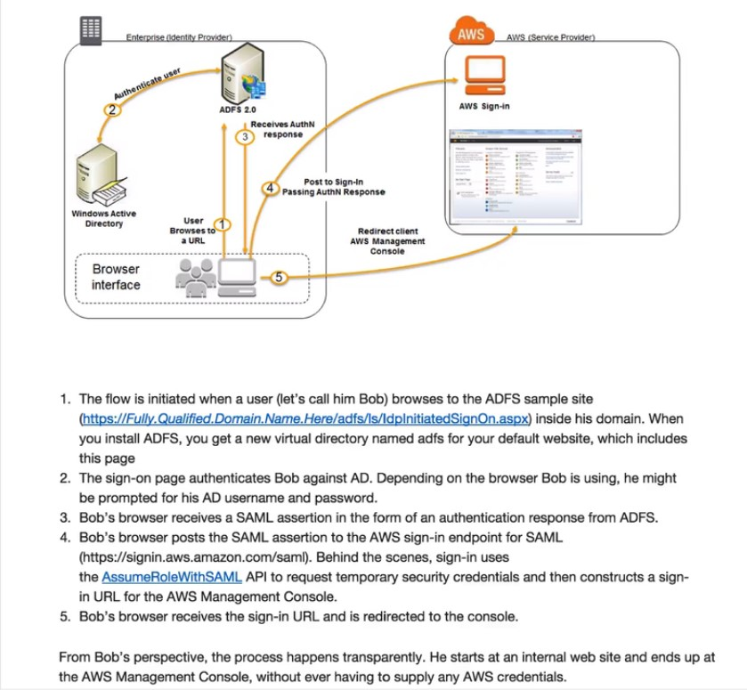

# Identity Access Management (IAM)
### 
**IAM 101** 

Essentially, IAM allows you to manage users and their level of access to the **AWS** Console. It is important to understand IAM and how it works, both for the exam and for administrating a company's AWS account in real life.

What does IAM give you ?
- Centralised control of your AWS account;
- Shared Access to your AWS account;
- Identity Federation (including **Active Directory, Facebook, Linkedin, etc..**);
- Multifactor Authentication (**2FA..**);
- Provide temporary access for users/devices and services where necessary;
- Allows you to setup your own password rotation policy;
- Integrates with many different AWS services;
- Supports PCI DSS Compliance.
--- 
## Critical Terms
- **Users** - End Users (Think people)
- **Groups** - A collection of users under one set of permissions
- **Roles** - You create roles and can assign them to AWS resources
- **Policies** - A document that defines one (or more permissions)
---
### First LAB (IAM)
- At **IAM** dashboard you can:
    - Activate MFA;
    - Create individual IAM users;
    - Create / Use groups to assign permissions;
    - Apply IAM password policy
    - Create/Manage users/groups;
    - Create/Manage roles.

- Tip: 
    - Access Key ID  / Secret Access Key
        - Can be used just with SDK's
---
### Active directory federation

- **Remember**: Tipe of authentication: **SAML**

---

### Web identity Federation

- You can auth your applications use facebook, google, etc..
- **Steps**:
    1. Auth with identity provider;
    2. Obtain temporary Security Credentials;
    3. Access AWS Resources.
- Playground here:
    - https://web-identity-federation-playground.s3.amazonaws.com/index.html
    - Generate access token..
- The API call used to obtain temporary security credentials when authenticating using Web Identity Federation is called **AssumeRoleWithWebIdentity**
- The API call used to request temporary security from rom the AWS platform when federating with Active Directory is **AssumeRoleWithSAML**
- SAML stands for Security Assertion Markup Language.
- The AWS sign-in endpoint for SAML is https://signin.aws.amazon.com/saml

---

# IAM Summary

- IAM consists of the following;
    - Users
    - Groups (a way to group our users and apply policies to them collectively)
    - Roles
    - Policy Documents (JSON)

- **IAM** is universal. It does not apply to regions at this time;
- The "root account" is simply the account created when first setup your AWS account. It has complete Admin access. 
- New Users have **NO** permissions when first created.
- New Users are assigned **Access key ID & Secrete Access key** when first created.
- There are not the same as a password, and you cannot use the Access key ID & Secret Access Key to Login in to the console. You can use this to access AWS **via the APIs and Command Line.**
- You only get to view these **once**. If you lose them, you have to regenerate them. **So save them in a secure location**
- Always setup Multifactor Auth on your root account.
- You can create and customise your own password rotation policies.